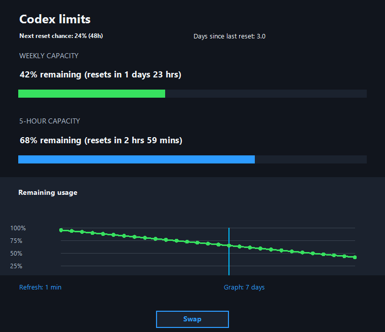
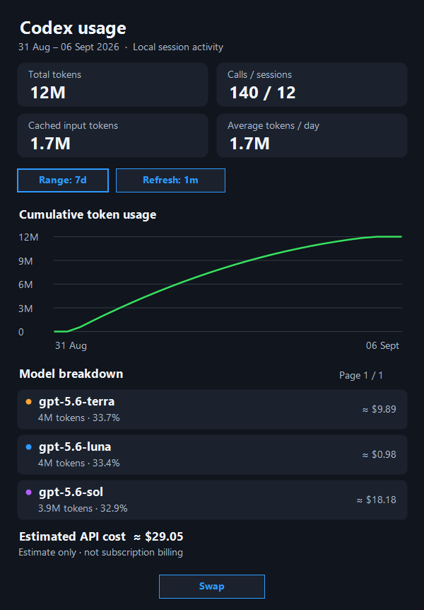
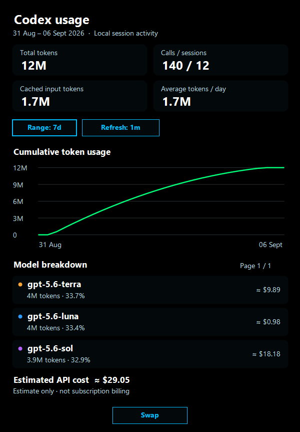
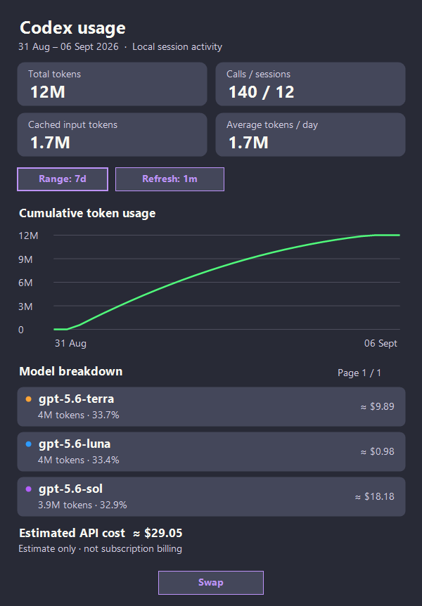
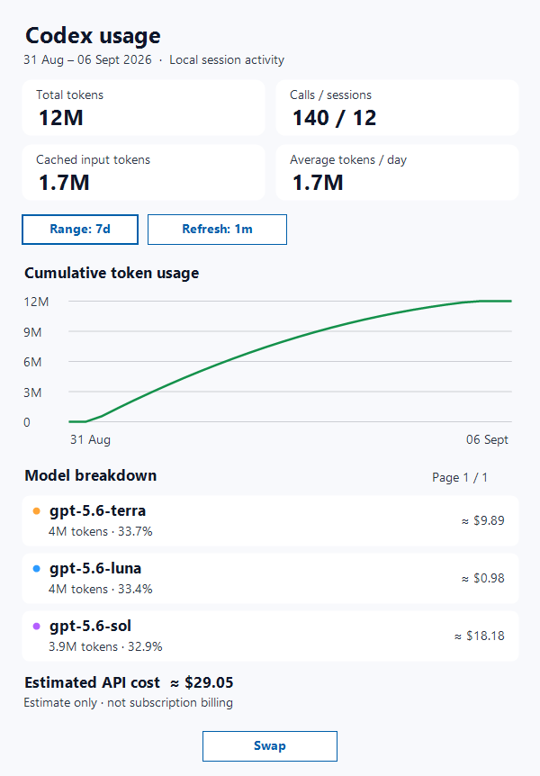

# Codex Usage Tray

**Your Codex capacity and activity, one click away.**

A Windows tray companion for usage limits, reset timing, and local session analytics.

[](https://github.com/colemanuk82/CodexUsageTray/releases/latest)
[](#requirements)
[](LICENSE)

[Download](https://github.com/colemanuk82/CodexUsageTray/releases/latest) · [Getting started](#getting-started) · [Themes](#themes) · [Build from source](#build-from-source)

## At a glance

| Limits | Usage |
| :---: | :---: |
|  |  |

*Interface previews use illustrative sample data.*

Keep live capacity close without another taskbar window. The limits view shows what remains; the usage view explains your local activity over time.

- **Capacity at a glance.** Five-hour and weekly meters, reset countdowns, and a two-bar tray icon.
- **Readable summaries.** Total tokens, calls, sessions, cached input, and average daily usage.
- **Useful history.** Switch between 1-day, 7-day, and 30-day views, with reset markers on the limits chart.
- **Model detail.** Compare token share and estimated API cost, with page controls for additional models.
- **Personal appearance.** Seven themes with coordinated surfaces, text, controls, and chart accents.
- **Everyday convenience.** Refresh every minute or every five minutes, and optionally start with Windows.

## Getting started

1. Download the setup executable from the [latest release](https://github.com/colemanuk82/CodexUsageTray/releases/latest).
2. Run the installer. It installs for the current user, creates a Start Menu shortcut, and launches the app.
3. Click the tray icon to open your limits. Choose **View usage** for session analytics.
4. Right-click the tray icon to choose a theme, adjust settings, or exit.

The installer uses `%LOCALAPPDATA%\CodexUsageTray` and replaces an older running copy. If Windows hides the icon, open the tray overflow to find it.

### Requirements

- Windows 10 or later.
- An authenticated Codex CLI session with local authentication data.
- .NET 8 Desktop Runtime for framework-dependent builds. Self-contained builds include the runtime.

### Reading the interface

| Element | Meaning |
| --- | --- |
| Top tray bar | Weekly capacity remaining |
| Bottom tray bar | Five-hour capacity remaining |
| Red tray bars | The reset monitor reports a reset probability above 70% |
| Limits history | Remaining weekly capacity over the selected period |
| Cumulative token chart | Running token total across the selected calendar period |
| Estimated API cost | Approximate model usage cost, not a subscription charge or invoice |

Click the range and refresh controls to cycle their values. Press **Esc** to close either popout. Both windows scale to your display without scrollbars; use **Previous** and **Next** to browse model details.

## Themes

Select a theme from the tray icon’s right-click menu. Your choice is saved and applied to both windows.

| Theme | Appearance |
| --- | --- |
| Default | Slate surfaces, soft text, and blue accents |
| AMOLED | Pure-black background with vivid accents |
| Dracula | Purple-gray surfaces with lavender highlights |
| Nord | Cool blue-gray surfaces and muted Nordic colours |
| Solarized Dark | Deep teal surfaces with blue and gold accents |
| Light | Bright surfaces with dark text |
| Glass | Subtly translucent dark-blue surfaces |

<details>
<summary>View theme previews</summary>

| AMOLED | Dracula | Light |
| :---: | :---: | :---: |
|  |  |  |

</details>

## Data and privacy

Session analytics are calculated locally. The app does not upload local session history or collect telemetry. It uses the existing Codex authentication token to request account usage; no separate sign-in form is required.

| Source | Purpose |
| --- | --- |
| `%USERPROFILE%\.codex\auth.json` | Existing authentication for the account usage request |
| `%USERPROFILE%\.codex\sessions` | Local token counts, model activity, calls, and sessions |
| `%LOCALAPPDATA%\CodexUsageTray` | Local history, settings, caches, and diagnostic logs |
| ChatGPT usage service | Live account limits via `/backend-api/wham/usage` |
| Codex Reset Today API | Public reset announcements and probability estimates |
| Public model-pricing pages | Periodic pricing updates for cost estimates |
| GitHub | Release checks and update links |

Reset information comes from the public [Codex Reset Today API](https://codex-reset.today/developers) and is cached locally. Model pricing uses built-in fallback rates and a periodically refreshed local cache. Unavailable model rates are labelled in the interface.

## Build from source

Install the .NET 8 SDK or a compatible newer SDK on Windows, then run from the repository directory:

```powershell
dotnet build -c Release
```

Publish a framework-dependent Windows x64 build:

```powershell
dotnet publish -c Release -r win-x64 --self-contained false
```

Or publish a self-contained single-file executable:

```powershell
dotnet publish -c Release -r win-x64 --self-contained true /p:PublishSingleFile=true
```

The published executable is written to:

```text
bin\Release\net8.0-windows\win-x64\publish\CodexUsageTray.exe
```

## Troubleshooting

- **No account limits:** confirm that Codex is signed in and the local authentication file exists.
- **No usage history:** analytics appear after Codex writes session activity. The limits chart needs a few refreshes to accumulate history.
- **Unavailable cost:** a matching model rate may not be available. Estimates can differ from actual billing.
- **Startup or refresh problems:** inspect `%LOCALAPPDATA%\CodexUsageTray\crash.log` if present. Remove sensitive information before sharing logs in an issue.

## License and acknowledgements

Released under the [MIT License](LICENSE). Reset data is provided by [Codex Reset Today](https://codex-reset.today/).

This independent project is not affiliated with or endorsed by OpenAI. Official account usage remains authoritative; reset probabilities and API cost estimates are not guarantees or billing data.
